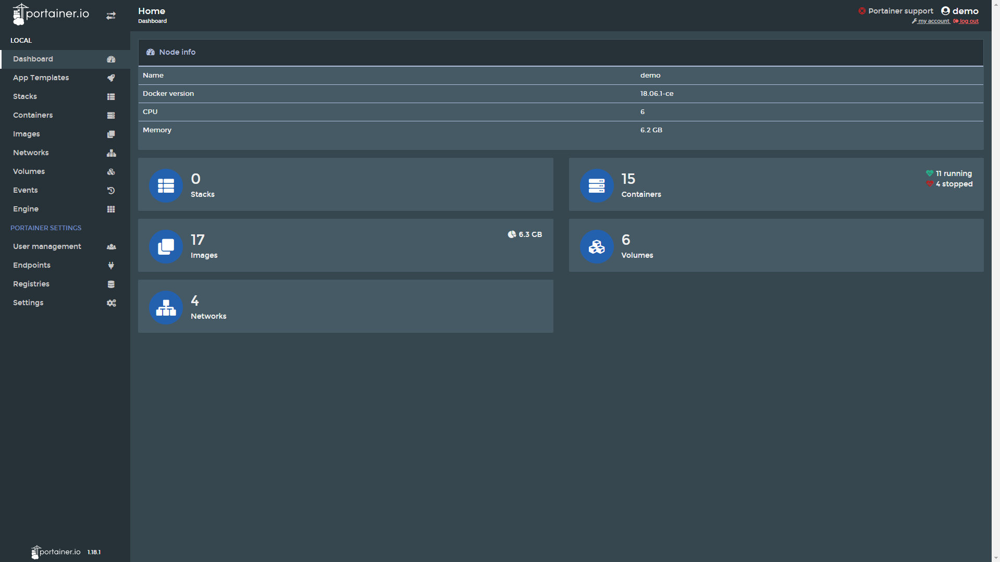
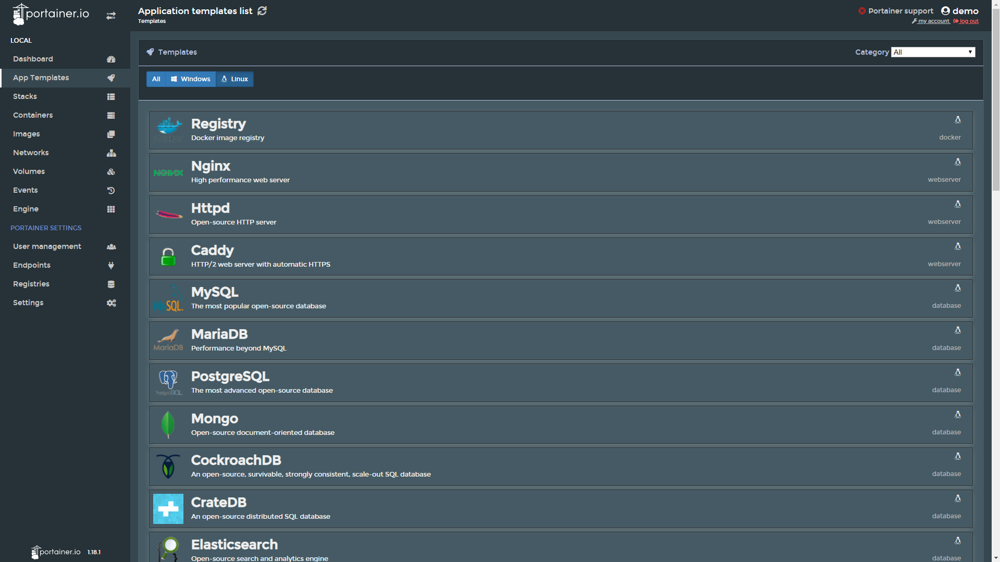

# Portainer Night Mode
A simple Night Mode CSS for [Portainer](https://www.portainer.io/) web pages.

Color palette used: [Blue Gray 50](https://material.io/design/color/#tools-for-picking-colors)

## Installation
You can install the stylesheet in any browser style extension such as [Stylus](https://chrome.google.com/webstore/detail/stylus/clngdbkpkpeebahjckkjfobafhncgmne) or [Stylish](https://chrome.google.com/webstore/detail/stylish-custom-themes-for/fjnbnpbmkenffdnngjfgmeleoegfcffe).

#### Note
Don't forget to specify the URL of your Portainer instance when installing the stylesheet. Otherwise, the styles will
apply globally.